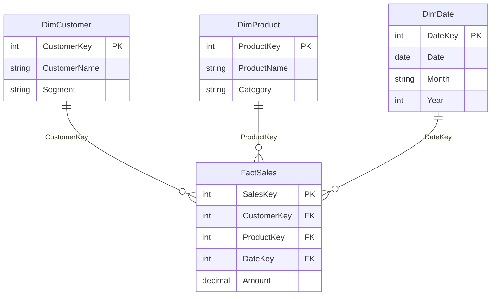

# Power BI Documentation Skill

Generate comprehensive, standardized documentation for Power BI semantic models using an interactive workflow.

## Prerequisites

Before starting documentation, ensure:
1. The powerbi-modeling-mcp server is connected and available
2. Connection to the target semantic model is established (Power BI Desktop, Fabric workspace, or PBIP folder)

## Interactive Documentation Workflow

**CRITICAL:** This skill uses a conversational approach. Claude MUST ask questions one at a time and wait for user responses before proceeding. Do NOT generate the document until all questions are answered. All questions use numbered options (1/2/3/...) for consistency — never use Yes/No style answers.

### Phase 1: Connect and Gather Metadata

Before asking any questions, Claude should:

1. **Connect to the semantic model** using `connection_operations`
2. **Gather basic model information** using `model_operations`:
   - Model name
   - Table count (and table names for classification)
   - Measure count (including display folders)
   - Relationship count
   - File name (for document title)
   - Last modified date
3. **Check for calculation groups** using `calculation_group_operations` (ListGroups)
4. **Classify tables** by analyzing naming conventions and structure:
   - Fact tables (e.g., `fact_*`, `fct_*`, or tables with numeric measures and foreign keys)
   - Dimension tables (e.g., `dim_*`, `d_*`, or lookup/reference tables)
   - Parameter tables (e.g., `para_*`, `param_*`, or tables with What-If parameters)
   - Bridge/mapping tables
   - Date tables
   - Calculated tables
   - Other/Utility tables

This information is needed to ask informed questions and provide sensible defaults.

### Phase 2: Interactive Configuration

Start the interactive configuration with welcoming the user to the 'The Data Forest's interactive Power BI documentation generator'.
Then ask these questions **one at a time**, waiting for user response before proceeding to the next.

#### Pre-Question: Additional Business Context
```
Before we start configuring the documentation, would you like to upload any additional business context?

This can be any kind of documentation — business requirements, data dictionaries, 
stakeholder briefs, existing wiki pages, design documents, or anything else that 
describes the purpose and context of this model.

Providing this context helps me generate richer, more accurate descriptions, 
executive summaries, and recommendations tailored to your actual business needs.

1. Yes, I'd like to upload some documents (I'll attach them now)
2. No, let's proceed without additional context

[1/2]:
```

**If the user selects 1:** Wait for the user to upload their file(s). Once received, read and analyze the uploaded documents from `/mnt/user-data/uploads/`. Extract key information such as:
- Business domain and purpose of the model
- Key stakeholders and their reporting needs
- Important business processes and KPIs
- Data source descriptions and ownership
- Any naming conventions or terminology definitions
- Known limitations or scope boundaries

Store this extracted context mentally and use it throughout the documentation generation to:
- **Executive Summary:** Incorporate actual business purpose, stakeholders, and scope rather than inferring from model structure alone
- **Table & Measure Descriptions:** Use domain-specific language and business terminology from the uploaded context
- **Recommendations:** Tailor suggestions to the actual business requirements and stakeholder needs
- **Business Glossary:** Pre-populate with terms and definitions found in the uploaded documents
- **Data Sources:** Enrich with any data lineage or ownership information from the context

After reading the documents, briefly confirm what context was extracted: "Thanks! I've reviewed your documents and found context about [brief summary]. I'll use this to enrich the documentation. Let's continue with the configuration."

**If the user selects 2:** Proceed normally. The documentation will be generated based solely on the semantic model metadata.

#### Question 0: Documentation Template
```
How would you like to set up the documentation?

I can offer you a preset template or let you configure each section manually:

1. Internal documentation preset (comprehensive, includes all technical details, recommendations, and DAX code)
2. Client documentation preset (polished, business-focused with executive summary, glossary, and clean formatting — less technical detail)
3. Manual configuration (I'll walk you through each section one by one)

[1/2/3]:
```

**If the user selects 1 (Internal) or 2 (Client):** Show the preset configuration summary (see Preset Templates section below) and proceed to Phase 3 after confirming. Still ask the Title question (Question 2) and Language question (Question 1) before showing the preset summary. If the user wants to customize any part of the preset, allow them to override individual settings.

**If the user selects 3 (Manual):** Continue with all questions below.

#### Question 1: Documentation Language
```
What language should the documentation be written in?

1. English
2. Dutch (Nederlands)
3. French (Français)
4. German (Deutsch)
5. Other (please specify)

[1/2/3/4/5]:
```

The selected language applies to all generated prose, section headers, descriptions, and analysis. Table/column/measure names remain as defined in the model. DAX code is never translated.

#### Question 2: Document Title
```
What should be the title of the documentation?

I detected the model name is "[Model Name]" from [File Name].
Default: "Power BI Semantic Model Documentation: [Model Name]"

1. Use default title
2. Custom title (please type your preferred title)

[1/2]:
```

#### Question 3: Executive Summary
```
Would you like to include an executive summary?

This section provides a high-level overview of the model's purpose and scope.

1. Yes, I'll provide the business context
2. Yes, generate a summary based on the model structure
3. No, skip the executive summary

[1/2/3]:
```

If user selects option 1, ask: "Please describe the business purpose of this model, key stakeholders, and any relevant context."

#### Question 4: Data Sources
```
Would you like to include a Data Sources section?

This documents all data connections including:
- Overview of the data source strategy
- Connection details for each source (type, location, authentication)
- Power Query M code samples

1. Yes, include Data Sources
2. No, skip Data Sources

[1/2]:
```

#### Question 5: Visual Model Diagram
```
Would you like me to create a separate visual model diagram file?

This creates a Mermaid ER diagram file showing all [X] tables and [Y] relationships.
The main document will reference this separate diagram file.

1. Yes, create a single diagram file
2. Yes, but split into multiple diagrams by subject area (recommended for 15+ tables)
3. No, skip the diagram

[1/2/3]:
```

#### Question 6: Relationships Documentation
```
Would you like to include the Relationships section?

This includes:
- A comprehensive table of all [Y] relationships
- Analysis of relationship patterns (star schema, bidirectional filters, role-playing dimensions)

1. Yes, include Relationships
2. No, skip Relationships

[1/2]:
```

#### Question 7: Tables Documentation
```
Would you like to document all tables?

I detected [X] tables, organized as follows:
- [N] Fact tables: [list names]
- [N] Dimension tables: [list names]
- [N] Parameter tables: [list names]
- [N] Other tables: [list names]

This creates a detailed section for each table, grouped by type, including:
- Purpose and table type
- Key columns with data types
- Related relationships

1. Yes, document all tables (grouped by type)
2. Yes, but only include a summary table
3. No, skip Tables

[1/2/3]:
```

#### Question 8: Measures Documentation
```
Would you like to include measure documentation?

The model contains [Z] measures[, organized in [N] display folders: [list folder names]].

1. Yes, include full documentation (organized by display folder, with detailed DAX for each measure)
2. Yes, but only include a summary table
3. No, skip measures

[1/2/3]:
```

#### Question 9: Calculation Groups (only ask if calculation groups exist)
```
Would you like to document the calculation groups?

The model contains [N] calculation group(s): [list names].

1. Yes, include full documentation (group definitions, calculation items with DAX)
2. Yes, but only a summary
3. No, skip calculation groups

[1/2/3]:
```

#### Question 10: Recommendations
```
Would you like to include a Recommendations section?

This analyzes the model and provides improvement suggestions based on:
- Kimball dimensional modeling best practices (star schema design, grain, conformed dimensions)
- Power BI best practices (naming conventions, performance optimization, DAX patterns)

I'll review the model against these frameworks and include only the recommendations that are relevant to your specific model.

1. Yes, include recommendations (Kimball + Power BI best practices)
2. Yes, but only Kimball data model recommendations
3. Yes, but only Power BI technical best practices
4. No, skip recommendations

[1/2/3/4]:
```

#### Question 11: Business Glossary
```
Would you like to include a Business Glossary in the appendix?

This defines key business terms and metrics used in the model.

1. Yes, I'll provide the glossary terms
2. Yes, generate based on measure and table names
3. No, skip the glossary

[1/2/3]:
```

If user selects option 1, ask: "Please provide the business terms and their definitions (you can format as 'Term: Definition' on separate lines)."

### Preset Templates

#### Internal Documentation Preset
```
Internal documentation preset:
- Language: [as selected]
- Title: [as selected]
- Executive Summary: Auto-generated
- Data Sources: Included
- Visual Diagram: Single file (or split if 15+ tables)
- Relationships: Included
- Tables: Full documentation, grouped by type
- Measures: Full documentation with DAX, organized by display folder
- Calculation Groups: Included (if any exist)
- Recommendations: Full (Kimball + Power BI best practices)
- Business Glossary: Auto-generated
- Technical Specifications: Included
```

#### Client Documentation Preset
```
Client documentation preset:
- Language: [as selected]
- Title: [as selected]
- Executive Summary: Auto-generated
- Data Sources: Excluded
- Visual Diagram: Single file (or split if 15+ tables)
- Relationships: Included
- Tables: Summary table only
- Measures: Full documentation with DAX, organized by display folder
- Calculation Groups: Summary only (if any exist)
- Recommendations: Excluded
- Business Glossary: Auto-generated
- Technical Specifications: Included
```

### Phase 3: Generate Documentation

Once all questions are answered, Claude should:

1. **Confirm the configuration** with a brief summary:
```
Ready to generate documentation with these settings:

Language: [Selected language]

Document Structure:
├── Title: [Title]
├── Executive Summary: [User content / Auto-generated / Skipped]
├── Data Sources: [Included / Skipped]
├── Data Model
│   ├── Visual Diagram: [Separate file / Split files / Skipped]
│   └── Model Statistics (auto-included)
├── Relationships: [Included / Skipped]
├── Tables: [Full (by type) / Summary only / Skipped]
├── Calculations
│   ├── Measures: [Full (by display folder) / Summary only / Skipped]
│   └── Calculation Groups: [Full / Summary / Skipped / N/A]
├── Recommendations: [Full / Kimball only / Power BI only / Skipped]
└── Appendix
    ├── Business Glossary: [User-provided / Auto-generated / Skipped]
    └── Technical Specifications (auto-included)

Proceed?
1. Yes, generate documentation
2. No, I want to change something

[1/2]:
```

2. **Gather required data** from the MCP server based on selected sections
3. **Generate the Word document** using the docx skill
4. **Generate the diagram file(s)** if selected (separate .mermaid file)

---

## Document Structure Specification

The generated document follows this exact structure. All prose, headers, and descriptions are written in the selected documentation language.

### Title Page / Header

```
# [Document Title]
```

### Executive Summary (if selected)

```
## Executive Summary

[2-4 paragraphs describing:]
- The business purpose of this semantic model
- Key business processes or domains covered
- Primary stakeholders and use cases
- Scope and any important limitations

[If user-provided: use their content]
[If auto-generated: analyze tables, measures, and relationships to infer the business domain]
```

### Data Sources (if selected)

```
## Data Sources

### Overview

[Brief description of the data source strategy:]
- Number of distinct data sources
- Import vs DirectQuery approach
- Refresh strategy (if detectable)

### Data Source Details

[For each unique data source, create a subsection:]

#### [Source Name/Type]

Connection type: [Folder, SQL Server, Excel, SharePoint, Web API, etc.]
Location: [Server/path/URL - REDACT sensitive credentials]
Authentication: [Windows, Service Principal, Anonymous, etc.]
Source files: [List of tables/files using this source]

Power Query M code sample:
[Code block with M code snippet - REDACT sensitive values]
```

Data source details use inline key-value pairs with bold labels.

### Data Model

```
## Data Model

### Visual Model Diagram

[Describe the overall model architecture:]
- Star schema / Snowflake schema / Hybrid approach
- Number of fact tables and their grain
- Dimension organization strategy
- Any notable design patterns (role-playing dimensions, bridge tables, etc.)

[If diagram selected: embed the mermaid diagram text inline in a code block]
[Also create separate .mermaid file]

### Model Statistics

Total tables: [X] (excluding system tables)
  Fact tables: [N]
  Dimension tables: [N]
  Parameter tables: [N]
  Other tables: [N]
Total measures: [Z]
Total relationships: [Y]
Total columns: [Total across all tables]
Default mode: [Import / DirectQuery / Dual]
```

Model statistics use inline key-value pairs with bold labels.

### Relationships (if selected)

```
## Relationships

### Relationships Overview Table

[Table with columns: From Table, From Column, To Table, To Column, Cardinality, Cross Filter, Active]

### Relationship Patterns

[Analysis paragraph, then key-value pairs:]

Schema type: [Star Schema / Snowflake Schema / Hybrid]
Conformed dimensions: [Analysis of shared dimensions]
Filter direction: [Analysis of filter patterns]
Date dimension: [Analysis of date relationships]
[etc.]
```

### Tables (if selected)

**IMPORTANT:** Tables are grouped by type with a subsection header for each group. Within each group, tables are listed alphabetically.

```
## Tables

### Fact Tables

[For EACH fact table:]

#### [Table Name]

Purpose: [What business entity or process this table represents]
Table type: Fact
Partition mode: [Import / DirectQuery / Dual]
Data source: [Which source this comes from]
Row count: [If available]

Columns:
[Table with columns: Column Name, Data Type, Description]

[If calculated table, add:]
DAX Expression:
[Code block with DAX expression — use monospace formatting]

Relationships:
[Comma-separated list: Related to [Table] (Cardinality on [column])]

### Dimension Tables

[For EACH dimension table, same structure as above with Table type: Dimension]

### Parameter Tables

[For EACH parameter table, same structure as above with Table type: Parameter]
[Include what-if parameter configuration details if applicable]

### Other Tables

[For any remaining tables: Bridge, Date, Calculated, Utility, etc.]
[Same structure, with appropriate Table type label]
```

### Calculations (if selected)

```
## Calculations

### Measures Summary

Total measures: [Z]
Display folders: [List of display folders found]
[Brief description of measure organization]

### Measure Details

[Measures are grouped by display folder. Each display folder becomes an H3 heading.
Within each folder, measures are listed alphabetically.
Measures without a display folder are grouped under "Ungrouped Measures".]

#### [Display Folder Name]

##### [Measure Name]

Description: [Business-friendly explanation - infer if not provided in metadata]
Table: [Table where measure is defined]
Format: [Format string if available]

DAX formula:
[Code block with complete DAX code — use monospace font with light gray background]

Business logic: [Plain language explanation of what the DAX does]
[If measure depends on other measures:]
Dependencies: [List of referenced measures]

[Repeat for ALL measures in this display folder]

#### [Next Display Folder Name]

[Repeat structure...]

#### Ungrouped Measures

[Measures without a display folder]
```

### Calculation Groups (if selected)

```
## Calculation Groups

[For EACH calculation group:]

### [Calculation Group Name]

Description: [Purpose and usage of this calculation group]
Precedence: [Precedence value]
Table: [Associated table name]

#### Calculation Items

[For EACH calculation item:]

##### [Item Name]

Ordinal: [Order position]
Description: [What this calculation item does]

DAX Expression:
[Code block with DAX expression — use monospace font]

[If format string expression exists:]
Format String Expression:
[Code block with format string DAX]

[If the calculation group has a no-selection expression:]
No Selection Expression:
[Code block with DAX]

[If the calculation group has a multiple/empty selection expression:]
Multiple or Empty Selection Expression:
[Code block with DAX]
```

### Recommendations (if selected)

```
## Recommendations

[This section analyzes the model against established best practices and provides specific, actionable recommendations. Only include recommendations that are actually relevant to the model.]

### Data Model Recommendations

[Based on Kimball dimensional modeling methodology:]
- Star schema conformance (are facts and dimensions properly separated?)
- Grain definition clarity
- Conformed dimension usage
- Slowly changing dimension handling
- Bridge table patterns
- Degenerate dimension usage
- Junk dimension opportunities
- Fact table type appropriateness (transaction, periodic snapshot, accumulating snapshot)

[Reference: Kimball Group dimensional modeling best practices.
If the kimball-dimensional-modeling skill is available, consult it for detailed guidance.]

### Power BI Best Practices

[Based on the Tabular Editor Best Practice Analyzer (BPA) standard rules from Microsoft's Analysis Services repository. Analyze the model against each category below and report ONLY the violations actually found. Do not list rules that the model already complies with.]

#### Performance

Check for and report violations of these rules:
- **Avoid floating point data types:** Flag columns using the "Double" data type — recommend "Int64" or "Decimal" instead (Decimal is limited to 4 decimal places)
- **Set IsAvailableInMdx to false on non-attribute columns:** Hidden columns not used as Sort By columns, in hierarchies, or in variations should have IsAvailableInMdx set to false to speed up processing and conserve memory
- **Avoid bi-directional relationships against high-cardinality columns:** Bi-directional cross-filtering on high-cardinality columns degrades performance
- **Consider star schema over snowflake:** Flag tables that appear on both sides of relationships (acting as both fact and dimension) — recommend flattening into a star schema
- **Model should have a date table:** Flag if no table is marked as a date table (DataCategory = "Time" with a DateTime key column)
- **Date/calendar tables should be marked as date tables:** Tables with "date" or "calendar" in the name should be marked as a date table with a proper DateTime key
- **Remove auto-date tables:** Flag presence of auto-generated date tables (DateTableTemplate_ or LocalDateTable_ prefixed tables) — recommend disabling auto-date in Power BI Desktop settings
- **Avoid excessive bi-directional or many-to-many relationships:** Flag if more than 30% of relationships are bi-directional or many-to-many
- **Many-to-many relationships should be single-direction:** Flag many-to-many relationships with bi-directional cross-filtering
- **Reduce calculated columns using RELATED:** Calculated columns with RELATED() should be moved to the data source
- **Reduce calculated tables:** Flag all calculated tables — recommend migrating logic to the data warehouse
- **Reduce total calculated columns:** Flag if model has more than 5 calculated columns — recommend offloading to data source
- **Minimize Power Query transformations:** Flag partitions with heavy M transformations (Table.Combine, Table.Join, Table.NestedJoin, Table.AddColumn, Table.Group, Table.Sort, Table.Pivot, Table.Unpivot, etc.) — recommend query folding or offloading to data warehouse
- **Unpivot pivoted month data:** Flag tables with month-named numeric columns (Jan, Feb, Mar...) — recommend unpivoting
- **Limit RLS logic complexity:** Flag RLS expressions using string functions (RIGHT, LEFT, UPPER, LOWER, FIND) — recommend offloading logic to data warehouse
- **Avoid many-to-many with dynamic RLS:** Flag tables using both many-to-many relationships and row-level security
- **Time intelligence with DirectQuery:** Flag measures using time intelligence functions in DirectQuery models — suggest alternative patterns

#### DAX Expressions

Check for and report violations of these rules:
- **Column references should be fully qualified:** In measures and calculation items, columns must be referenced as 'Table'[Column], not just [Column]
- **Measure references should be unqualified:** Measures should be referenced as [MeasureName] without table prefix to distinguish from columns
- **No duplicate measure definitions:** Flag measures with identical DAX expressions (ignoring whitespace)
- **Use TREATAS instead of INTERSECT:** For virtual relationships, TREATAS is more efficient than INTERSECT
- **Use DIVIDE function for division:** Flag measures using "/" operator for division — recommend DIVIDE() to handle divide-by-zero
- **Avoid IFERROR function:** Flag measures using IFERROR — recommend DIVIDE() or proper error handling instead
- **No direct measure-to-measure references:** Flag measures whose entire expression is just a reference to another measure — these are redundant
- **Filter columns, not tables in CALCULATE:** Flag FILTER('Table', 'Table'[Column] = "Value") patterns — recommend using KEEPFILTERS or direct predicates
- **Filter measure values by columns, not tables:** Flag FILTER('Table', [Measure] > Value) — recommend FILTER(VALUES('Table'[Column]), [Measure] > Value)
- **Inactive relationships should be activated somewhere:** Flag inactive relationships never referenced by USERELATIONSHIP in any measure
- **Avoid '1-(x/y)' syntax:** Flag measures using 1-SUM()/SUM() pattern — recommend rewriting with DIVIDE for better performance and blank handling
- **Remove EVALUATEANDLOG in production:** Flag any measures using EVALUATEANDLOG — this is a debugging function not for production

#### Error Prevention

Check for and report violations of these rules:
- **Data columns must have a source column:** Flag data columns with empty/null source column property
- **Expressions must not be empty:** Flag measures, calculated columns, or calculation items with empty expressions
- **Relationship columns same data type:** Flag relationships where the from-column and to-column have different data types
- **Avoid USERELATIONSHIP and RLS on same table:** Flag tables referenced in USERELATIONSHIP that also have RLS — this causes errors
- **No invalid characters in names:** Flag objects with control characters in their names
- **No invalid characters in descriptions:** Flag objects with control characters in their descriptions
- **IsAvailableInMdx must be true on required columns:** Columns used in Sort By, hierarchies, or variations must have IsAvailableInMdx = true

#### Maintenance

Check for and report violations of these rules:
- **Remove unnecessary columns:** Flag hidden columns not referenced by any DAX, relationships, hierarchies, Sort By, or RLS
- **Remove unnecessary measures:** Flag hidden measures not referenced by any other DAX expression
- **Fix referential integrity violations:** Flag relationships with orphaned foreign key values (blank members appearing in slicers)
- **Ensure tables have relationships:** Flag orphan tables not connected to any other table
- **Add descriptions to visible objects:** Flag visible tables, measures, and columns without descriptions — descriptions appear on hover in Power BI Desktop
- **Remove empty calculation groups:** Flag calculation groups with no calculation items
- **Remove empty perspectives:** Flag perspectives containing no objects

#### Naming Conventions

Check for and report violations of these rules:
- **Partition name should match table name:** For single-partition tables, the partition name should match the table name
- **No special characters in names:** Flag objects with tabs, line breaks, or other special characters in names
- **Trim object names:** Flag objects with leading or trailing spaces in names

#### Formatting

Check for and report violations of these rules:
- **Hide foreign keys:** Foreign key columns (many-side of relationships) should be hidden
- **Mark primary keys:** Primary key columns (one-side of relationships) should have IsKey = true
- **Hide fact table aggregation columns:** Numeric columns in fact tables referenced by SUM/COUNT/AVERAGE measures should be hidden
- **Format flag columns as Yes/No:** Columns starting with "Is" (Int64) or ending with "Flag" should use string Yes/No values
- **Provide format strings for measures:** All visible measures should have a format string assigned
- **Do not summarize numeric columns:** Numeric columns should have SummarizeBy = "None" to prevent accidental implicit aggregation in visuals
- **Relationship columns should be integer:** Columns used in relationships should ideally be Int64
- **Add data categories for geo columns:** Columns named "Country", "City", "Continent", "Latitude", "Longitude" should have appropriate DataCategory set
- **Sort month string columns:** Month columns of String type must have a SortByColumn set to ensure correct sort order (not alphabetical)
- **Capitalize first letter of objects:** Table, measure, hierarchy, and calculated object names should start with a capital letter
- **Provide format strings for Date columns:** DateTime columns with "Date" in the name should have format string "mm/dd/yyyy"

[For each category, list ONLY the actual violations found. Each recommendation should be numbered and formatted as:]
1. [Recommendation title]: [Detailed explanation of which specific objects violate the rule and the suggested fix]
```

### Appendix

```
## Appendix

### Business Glossary

[Table with columns: Term, Definition]

[If auto-generated: derive from measure names, table names, and column names]
[If user-provided: use their content]

### Technical Specifications

Compatibility level: [From model metadata]
Model name: [Model name from metadata]
Power BI file: [Actual .pbix file name or semantic model name]
Default mode: [Import / DirectQuery / Dual]
Culture: [e.g., nl-NL (Dutch - Netherlands)]
Source query culture: [If available]
Deployment environment: [Power BI Desktop / Fabric / etc.]
Last modified: [Last modified date from model metadata]
Document created: [Today's date - format: Month DD, YYYY]
```

---

## Separate Diagram File Format

When creating the visual diagram, output as a separate `.mermaid` file:

**Filename:** `[ModelName]_DataModel.mermaid`

**Content:**


**Cardinality notation:**
- `||--o{` : One-to-Many (dimension to fact)
- `||--||` : One-to-One
- `}o--o{` : Many-to-Many

**For large models (15+ tables):** Create multiple diagram files:
- `[ModelName]_Sales_Domain.mermaid`
- `[ModelName]_Inventory_Domain.mermaid`
- `[ModelName]_Shared_Dimensions.mermaid`

---

## MCP Tools Reference

| Tool | Purpose | When to Use |
|------|---------|-------------|
| `connection_operations` | Connect to semantic model | Always first |
| `model_operations` | Get model info, statistics, last modified | Always |
| `table_operations` | List tables, get partitions with M code | Data Sources, Tables sections |
| `column_operations` | Get columns for each table | Tables section |
| `relationship_operations` | List all relationships | Relationships section, Diagram |
| `measure_operations` | List measures with DAX | Calculations section |
| `named_expression_operations` | Get Power Query parameters | Data Sources section |
| `partition_operations` | Get partition details, M expressions | Data Sources section |
| `calculation_group_operations` | Get calculation groups and items | Calculation Groups section |

---

## Document Formatting Requirements — Visual Style Specification

Follow the docx skill for creating the .docx file. The document uses a **sage green color theme** with **Calibri** as the primary font and a clean, professional layout using inline key-value pairs instead of tables for metadata.

### Color Palette

| Element | Color | Hex Code |
|---------|-------|----------|
| H1 (Title) | Dark Sage | `#4E6557` |
| H2 (Main sections) | Dark Sage | `#4E6557` |
| H3 (Subsections) | Light Sage | `#8DA387` |
| H4 (Items) | Gray | `#646464` |
| Body text | Dark Charcoal | `#2D2D2D` |
| Table header background | Light Green | `#D5F0DB` |
| Table header text | Dark Sage | `#4E6557` |
| Table borders | Light Gray | `#CCCCCC` |
| Code block background | Light Gray | `#F5F5F5` |
| Code block text | Dark Charcoal | `#2D2D2D` |

### Page Setup

- US Letter size: width 12240, height 15840 DXA (7772400 x 10058400 EMU)
- 1-inch margins: 1440 DXA (914400 EMU) all sides
- Calibri font throughout (body text AND headings)

### Heading Styles

All headings use **Calibri, bold**, with these specific sizes and colors:

```javascript
// Heading style definitions for docx-js
paragraphStyles: [
  { id: "Heading1", name: "Heading 1", basedOn: "Normal", next: "Normal", quickFormat: true,
    run: { size: 40, bold: true, font: "Calibri", color: "4E6557" },
    paragraph: { spacing: { before: 120, after: 240 }, outlineLevel: 0 } },
  { id: "Heading2", name: "Heading 2", basedOn: "Normal", next: "Normal", quickFormat: true,
    run: { size: 32, bold: true, font: "Calibri", color: "4E6557" },
    paragraph: { spacing: { before: 280, after: 200 }, outlineLevel: 1 } },
  { id: "Heading3", name: "Heading 3", basedOn: "Normal", next: "Normal", quickFormat: true,
    run: { size: 28, bold: true, font: "Calibri", color: "8DA387" },
    paragraph: { spacing: { before: 240, after: 160 }, outlineLevel: 2 } },
  { id: "Heading4", name: "Heading 4", basedOn: "Normal", next: "Normal", quickFormat: true,
    run: { size: 24, bold: true, font: "Calibri", color: "646464" },
    paragraph: { spacing: { before: 200, after: 120 }, outlineLevel: 3 } },
]
```

**Size reference (half-points):** H1 = 40 (20pt), H2 = 32 (16pt), H3 = 28 (14pt), H4 = 24 (12pt), Body = 22 (11pt)

### Body Text

```javascript
// Default document style
default: { document: { run: { font: "Calibri", size: 22, color: "2D2D2D" } } }
```

- Font: Calibri, 11pt (size: 22 half-points)
- Color: `#2D2D2D` (dark charcoal — NOT pure black)
- Paragraph spacing: `{ after: 120 }` (6pt after)

### Inline Key-Value Pairs

**CRITICAL: The document uses inline "Label: Value" pairs for metadata instead of tables.** This is the primary formatting pattern for Model Statistics, Data Source Details, Table properties, and Measure properties.

Each key-value line is a single paragraph with two TextRuns:
1. **Bold label** (including colon and space): `"Label: "` — Calibri, 11pt, bold, color `#2D2D2D`
2. **Regular value**: `"value text"` — Calibri, 11pt, normal weight, color `#2D2D2D`

```javascript
// Example: "Document created: January 23, 2026"
new Paragraph({
  spacing: { before: 60, after: 120 },
  children: [
    new TextRun({ text: "Document created: ", font: "Calibri", size: 22, bold: true, color: "2D2D2D" }),
    new TextRun({ text: "January 23, 2026", font: "Calibri", size: 22, color: "2D2D2D" }),
  ]
})
```

For section labels that stand alone (like "Columns:" or "Relationships:" before content):
```javascript
new Paragraph({
  spacing: { before: 150, after: 120 },
  children: [
    new TextRun({ text: "Columns:", font: "Calibri", size: 22, bold: true, color: "2D2D2D" }),
  ]
})
```

### Tables (Data Tables Only)

Tables are used ONLY for structured data grids (relationships overview, columns per table, business glossary). NOT for metadata/properties.

```javascript
// Table header cells: light green background with dark sage bold text
new TableCell({
  borders,
  width: { size: cellWidth, type: WidthType.DXA },
  shading: { fill: "D5F0DB", type: ShadingType.CLEAR },
  margins: { top: 80, bottom: 80, left: 120, right: 120 },
  children: [new Paragraph({ children: [
    new TextRun({ text: "Column Name", font: "Arial", size: 22, bold: true, color: "4E6557" })
  ] })]
})

// Table body cells: no shading, regular text
new TableCell({
  borders,
  width: { size: cellWidth, type: WidthType.DXA },
  margins: { top: 80, bottom: 80, left: 120, right: 120 },
  children: [new Paragraph({ children: [
    new TextRun({ text: "value", font: "Calibri", size: 22, color: "2D2D2D" })
  ] })]
})
```

**Important table details:**
- Header row font: **Arial** (not Calibri), bold, dark sage (`#4E6557`)
- Header row background: `#D5F0DB` (light green)
- Use `ShadingType.CLEAR` (never SOLID)
- Borders: gray (`#CCCCCC`), single line
- Cell padding: 80 DXA top/bottom, 120 DXA left/right
- Set both `columnWidths` on table AND `width` on each cell
- Always use `WidthType.DXA`

### Code Blocks (DAX and M code)

**CRITICAL: Code blocks use a monospace font (Consolas) with a light gray background to visually distinguish code from regular text.** This applies to all DAX expressions, M code samples, and calculated table expressions.

```javascript
// Code block container — each code block is wrapped in a bordered, shaded region
// For each line of code, create a separate paragraph:
new Paragraph({
  spacing: { before: 0, after: 0 },
  shading: { fill: "F5F5F5", type: ShadingType.CLEAR },
  indent: { left: 240 },  // slight left indent
  children: [
    new TextRun({ text: codeLine, font: "Consolas", size: 20, color: "2D2D2D" })
  ]
})
```

**Code block formatting rules:**
- Font: **Consolas** (monospace), 10pt (size: 20 half-points)
- Background: `#F5F5F5` (light gray) — applied via paragraph shading
- Text color: `#2D2D2D` (dark charcoal)
- Slight left indent: 240 DXA
- First line of a code block: `spacing: { before: 120, after: 0 }`
- Middle lines: `spacing: { before: 0, after: 0 }`
- Last line of a code block: `spacing: { before: 0, after: 120 }`
- Preserve all indentation using spaces in the text
- Each line of code is a separate Paragraph element to ensure proper rendering

```javascript
// Example: Multi-line DAX measure
const daxLines = [
  "Total Sales =",
  "    SUMX(",
  "        fact_sales,",
  "        fact_sales[Quantity] * RELATED(dim_product[UnitPrice])",
  "    )"
];

const codeParagraphs = daxLines.map((line, index) => 
  new Paragraph({
    spacing: { 
      before: index === 0 ? 120 : 0, 
      after: index === daxLines.length - 1 ? 120 : 0 
    },
    shading: { fill: "F5F5F5", type: ShadingType.CLEAR },
    indent: { left: 240 },
    children: [
      new TextRun({ text: line || " ", font: "Consolas", size: 20, color: "2D2D2D" })
    ]
  })
);
```

### Lists (Recommendations / Numbered Items)

For numbered recommendation items, use inline bold numbering (not Word list formatting):

```javascript
// "1. Fix the € COGS measure: Currently it uses..."
new Paragraph({
  spacing: { before: 60, after: 120 },
  children: [
    new TextRun({ text: "1. Fix the € COGS measure: ", font: "Calibri", size: 22, bold: true, color: "2D2D2D" }),
    new TextRun({ text: "Currently it uses product_selling_price...", font: "Calibri", size: 22, color: "2D2D2D" }),
  ]
})
```

For simple body text lists (like naming convention observations), use plain paragraphs with slight indentation via `spacing: { before: 60 }`.

### Complete Style Summary

| Element | Font | Size (half-pt) | Bold | Color | Spacing Before | Spacing After |
|---------|------|-----------------|------|-------|----------------|---------------|
| H1 | Calibri | 40 | Yes | 4E6557 | 120 | 240 |
| H2 | Calibri | 32 | Yes | 4E6557 | 280 | 200 |
| H3 | Calibri | 28 | Yes | 8DA387 | 240 | 160 |
| H4 | Calibri | 24 | Yes | 646464 | 200 | 120 |
| Body text | Calibri | 22 | No | 2D2D2D | 0 | 120 |
| Key-value label | Calibri | 22 | Yes | 2D2D2D | 60 | 120 |
| Key-value value | Calibri | 22 | No | 2D2D2D | (same paragraph) | |
| Section label | Calibri | 22 | Yes | 2D2D2D | 150 | 120 |
| Table header | Arial | 22 | Yes | 4E6557 | — | — |
| Table body | Calibri | 22 | No | 2D2D2D | — | — |
| Code block | Consolas | 20 | No | 2D2D2D | 120/0 | 0/120 |

---

## Handling Edge Cases

### Missing Descriptions
- Analyze DAX/structure to infer purpose
- Write description based on naming and logic
- Do NOT mark as inferred - just write good descriptions

### Very Large Models (30+ tables)
- Split diagram into subject areas
- Still document all tables individually (grouped by type)
- Consider alphabetical ordering within each table type group

### Many Measures (50+)
- Group measures by display folder (this is the default behavior)
- Still provide full details for each measure
- Use page breaks between display folder groups

### Sensitive Data Sources
- Redact: passwords, connection strings with credentials, internal server names
- Keep: connection type, general structure, table names
- Note: "Connection details redacted for security"

### Empty/Minimal Models
- Still generate all selected sections
- Note where sections are empty: "No measures defined in this model"

### No Display Folders
- If measures have no display folders assigned, group them by table instead
- Use table names as the grouping headers

### Table Classification
- If table naming conventions are unclear, analyze the table's columns, relationships, and measures to determine its type
- Tables with mostly numeric/additive columns and many foreign keys → Fact
- Tables with descriptive attributes and a primary key → Dimension
- Tables with What-If parameter patterns → Parameter
- When in doubt, classify as "Other" and describe the table's apparent purpose

---

## Quick Reference: Question Flow

- **Pre-Q: Business Context** → Upload documents / Skip
0. **Template** → Internal preset / Client preset / Manual
1. **Language** → English / Dutch / French / German / Other
2. **Title** → Default from model name / Custom
3. **Executive Summary** → User content / Auto / Skip
4. **Data Sources** → Include / Skip
5. **Visual Diagram** → Single file / Split / Skip
6. **Relationships** → Include / Skip
7. **Tables** → Full (by type) / Summary / Skip
8. **Measures** → Full (by display folder) / Summary / Skip
9. **Calculation Groups** → Full / Summary / Skip (only if groups exist)
10. **Recommendations** → Full / Kimball only / Power BI only / Skip
11. **Business Glossary** → User content / Auto / Skip
12. **Confirm** → Show structure tree, proceed

---

## Output Files

After generation, provide:
1. **Main document:** `[ModelName]_Documentation.docx`
2. **Diagram file(s):** `[ModelName]_DataModel.mermaid` (if selected)

Both files should be saved to the outputs directory and presented to the user.
